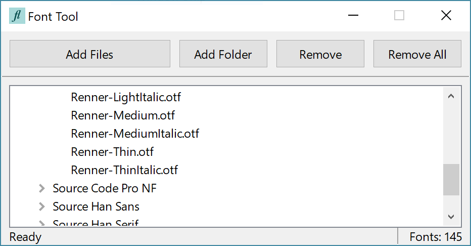

# Font Tool
## What?
Font Tool is a small utility to help people who operate on many workstations use their fonts in a portable way. This removes the necessity of having administrator privileges: the fonts are loaded into memory temporarily and are unloaded once the user logs off or closes the programme. No changes to the disk are made, save for a small `fonts` file which acts as a database to store locations of added fonts.

## Why?
Font Tool has been designed especially with portability and ease of use in mind. The executable weighs in at only ~1MB, is statically-linked, operating within a single executable which can be renamed and placed anywhere, and makes no permanent changes to the computer. However, for the most portability, it is recommended to place the executable in a folder on the _same drive_ as the user's font files to remove the dependency of a changing drive letter.

One aspect that makes this programme much better for font loading than other font-loading programmes, apart from its easy-to-use interface, is the multi-threaded approach to loading fonts. Instead of waiting `n * t` time for fonts to load, one must only wait `t` time as fonts are loaded in parallel,  boosting productivity and ease-of-use. (`n` is the number of fonts; `t` is the time taken for each font to load).

## How?
A minimal UI has been created to make it as easy as possible to load and unload fonts. One can load fonts by using the dedicated button, through drag-and-drop onto the window, through drag-and-drop onto the executable, as well as through a menu in the system tray for easy access. This vast array of methods is part of a struggle to make the programme as intuitive to use as possible.

Loaded fonts are convieniently displayed in a tree view and sorted by the  manner in which they were added.

Although the programme is not a font manager (see <a href="#why-not">Why Not?</a>), it tries to display fonts in folders as they are arranged on the disk. Fonts can be revealed by activating their corresponding item in the tree view.

Font Tool indexes loaded fonts into a database file `fonts` which is stored relative to the executable. The `fonts` file allows for the programme to automatically re-load previously-loaded fonts upon startup, further increasing the user's productivity if parallelisation was not enough. Of course, this means that Font Tool is partially dependant on a database file to operate as smoothly as possible (see  <a href="#why-not">Why Not?</a>).

## Who?
Font Tool is developed by a humble 15-year-old enduring the endless, excrutiating struggle of exam preparation. Due to the small nature of the project, compilation takes place through the use of scripts in _shell script_ which call the _MSVC_ compiler. This, of course, is unlike the programme itself, in that it is very <i>un</i>portable. Please feel free to fork this project, convert it to use a makefile instead, and request to pull.

## Why Not?
Font Tool is no font manager. Font managers include <a href="https://www.neuber.com/typograph/">Typograf</a> and <a href="http://www.xiles.net/">nexusfont</a>, which allow for much more control over already-installed and external fonts. Of course, this leads to a larger executable footprint and a greater difficulty of use, as well as bloaty features not useful for people who simply want to use fonts.

Font Tool is _dumb_! Error handling and font organisation are of minimal existance. The only way the programme attempts to group fonts is by their folder (if they were added as part of a folder), or whether the font is unable to be loaded. Furthermore, fonts are displayed by their filename, and the software makes no attempt to provide information to do with font contents: no previews, no display of font name, no display of font weight, etc. However, this allows the programme to be as lightweight as possible, and to minimise the amount of time required for use, maximising the time the user actually uses the loaded fonts.

Font Tool is _buggy_! Of course, it is created only by a school kid. There are still many ways to achieve `segmentation fault`s even after months of development. Please feel free to debug and fix these issues!

Font Tool is not totally independant. As explained in <a href="#how">How?</a>, Font Tool uses a database file `fonts`. This file can be deleted freely before, during and after the use of the programme, without any adverse effects. However, it is cautioned against modifying the `fonts` file directly as `segmentation fault`s can easily occur due to a lack of validation: the programme expects the `fonts` file to be perfectly formed.

## Get
To get the programme, go to the _releases_ tab in the code view. German versions of the programme are also available.

## Code
Font Tool is developed in <a href="https://isocpp.org/">C++</a> and C++ only. It relies on <a href="https://www.wxwidgets.org/">WxWidgets</a> to provide it's GUI, <a href="http://www.boost.org/">boost</a> for high-level filesystem functions, <a href="https://curl.haxx.se/">curl</a> to download updates, and <a href="https://www.threadingbuildingblocks.org/">Intel TBB</a> for concurrent vectors. As you can see, the code virtually crying for optimisation.

Compilation is through the use of a compile script. It is run in a _bash_ shell and calls the Microsoft Visual C++ Compiler. Inspect the `compile` script and adapt it to explore how to compile it on your machine.

The German translation is in broken German. It can be compiled by defining `LANG=1` to the preprocessor. Please see `locale.cpp` to help fix all the errors in translation.